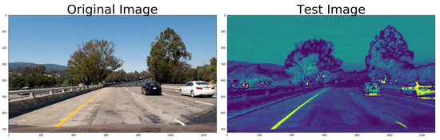

## Advanced Lane Finding

Project Description
---
In this project, my goal was to write a software pipeline to identify the lane boundaries in a video from 
front-facing camera on a car.

I download all the testing material and calibration images from the project repository.

Initially I calculated the camera matrix and distortion coefficients in order to undistort the images comming from the vehice's camera. Then I preprocess the images in order to be able to identify the lanes on the street and then I calculate the position of the camera and the steering angle and I displayed them in the outcome video. 

Camera Calibration
---

I used OpenCV functions in order to convert the image into gray scale and the having the chessboards I calculated the corners from several chessboard images. 

Then taking into consideration all the images and using the function cv2.calibrateCamera I calculated the Camera Matrix and the distortion coefficients.

Camera Matrix:  [[  1.15777818e+03   0.00000000e+00   6.67113858e+02]
[  0.00000000e+00   1.15282217e+03   3.86124582e+02]
[  0.00000000e+00   0.00000000e+00   1.00000000e+00]]

Distortion Coefficients :  [[-0.24688507 -0.02373157 -0.00109831  0.00035107 -0.00259863]]

Those were 9x6 chessboard images and according to the result the coefficients were correct calculated.

Pipeline
---

After distortion correction that was calculated via camera calibration I correctly applied to each image. At the following image you can see an example of undistorted street image.

And then: 

1) We blured the image in order to reduce noise

2) Then we convert the image from RGB to HLS in order to take the S-Channel of the image

3) Now we are able to identify the lines regardless the colour (yellow/white). Now we can calculate the gradients (combination of magnitude, Sobelx and Sobely) we can identify the pixels with the maximum change of colour. Offcourse first we convert the image into gray scale

    def PreProcessesOfImages (img):
        img = cv2.GaussianBlur(img, (5, 5), 0)
        hls = cv2.cvtColor(img, cv2.COLOR_RGB2HLS)
        SChannel = hls[:,:,2]
        gray = cv2.cvtColor(img, cv2.COLOR_RGB2GRAY)
        GradX = AbsSobelThreshold(gray, SobOrient=1, SobelKernel=7, threshold=(10, 255))
        GradY = AbsSobelThreshold(gray, SobOrient=2, SobelKernel=7, threshold=(55, 255))
        MagnitudeBinaryOutput = GradientMagnitudeThreshold(gray, SobelKernel=7, MagnitudeThreshold=(45, 255))
        DirectionBinaryOutput = GradientDirectionThreshold(gray, SobelKernel=7, threshold=(0.65, 1.1))
        CombinedOutput = np.zeros_like(DirectionBinaryOutput)
        CombinedOutput[((GradX == 1) & (GradY == 1)) | ((MagnitudeBinaryOutput == 1) & (DirectionBinaryOutput == 1))] = 1
        SChannelBinary = np.zeros_like(CombinedOutput)
        SChannelBinary[(SChannel > 150) & (SChannel < 255)] = 1
        ColorBinary = np.zeros_like(CombinedOutput)
        ColorBinary[(SChannelBinary > 0) | (CombinedOutput > 0)] = 1

        return ColorBinary

Perspective Function ("Birds-Eye view")
---

Having calculated the camera matrix we now have to create four point in order to create perspective view. We define an area of interest and...

    def PerspectiveOfImage(img, nx, ny, mtx, dist):
        undist = cv2.undistort(img, mtx, dist, None, mtx)
        offset1 = 200 
        offset2 = 0 
        offset3 = 0 
        img_size = (gray.shape[1], gray.shape[0])
        src = np.float32(area_of_interest)
        dst = np.float32([[offset1, offset3], 
        [img_size[0]-offset1, offset3], 
        [img_size[0]-offset1, img_size[1]-offset2], 
        [offset1, img_size[1]-offset2]])
        M = cv2.getPerspectiveTransform(src, dst)
        Minv = cv2.getPerspectiveTransform(dst, src)
        warped = cv2.warpPerspective(undist, M, img_size, flags=cv2.INTER_LINEAR) 
        return warped, M,Minv

Lane line pixels identification
---

I create a binary image and then I create the "birds - eye view" then I can generate the histogram and 
identify the picks:

Then, with this histogram I am adding up the pixel values along each column in the image. In my thresholded binary image, pixels are either 0 or 1, so the two most prominent peaks in this histogram will be good indicators of the x-position of the base of the lane lines. I can use that as a starting point for where to search for the lines. From that point, I can use a sliding window, placed around the line centers, to find and follow the lines up to the top of the frame.

Having the last sliced window we can fit the points LeftX and LeftY calculating the A,B,C values A, B, for polunomial function f(y)=Ay​2​​+By+C. (According to Udacity course)

    leftx = nonzerox[LeftLaneInds]
    lefty = nonzeroy[LeftLaneInds] 
    rightx = nonzerox[RightLaneInds]
    righty = nonzeroy[RightLaneInds] 

    yvals = np.linspace(0, img.shape[0], num=img.shape[0])
    LeftFit = np.polyfit(lefty, leftx, 2)
    LeftFitx = LeftFit[0]*yvals**2 + LeftFit[1]*yvals + LeftFit[2]
    RightFit = np.polyfit(righty, rightx, 2)
    RightFitx = RightFit[0]*yvals**2 + RightFit[1]*yvals + RightFit[2]

Radius of curvature and position of the vehicle Calculation
---

I calculated the histogram and then I calculated the midpoint of the histogram in order to seperate the left/right base (LeftXBase/RightXBase). After the calculation of the line by taking three points then by using those points I calculated the radius both for left and right
lane.

	def Find3pCircleRadius(x1,y1,x2,y2,x3,y3):
    
		m1 = (y2-y1)/(x2-x1)
		m2 = (y3-y2)/(x3-x2)
    
		xc = (m1*m2*(y1-y3)+m2*(x1+x2)-m1*(x2+x3))/(2*(m2-m1))
		yc = -(xc-(x1+x2)/2)/m1+(y1+y2)/2
    
		Radius = np.sqrt((x2-xc)*(x2-xc)+(y2-yc)*(y2-yc))
    
		return m1, m2, xc, yc, Radius
		
Then I calculated the turning radius by taking the mean value and the steering angle by summing up the steering angle of the left and right.

For the position of the camera. In perspective view we calculated the polylines and we know that the width of the lanes is 3.7 meters. So by taking the
position of the lines in pixel and the middle xpoint of the image, we can calculate the position of the vehicle.

	CameraPosition = OutputCombinedImage.shape[1]/2-(LeftFirstValue + RightFirstValue)/2
	
Then converted into physical distance and I displayed it in the image.

Finally I had:

Outcome Video
---

Conclusion
---

I really enjoyed this project. I seperated the colour channels and by creating the gradient with combination with the bird-eye view convertion I was able to identify the lanes on the street!!

Possible improvement could be the use of moving averages or a NN to make the lane identification more robust.