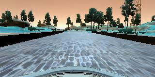
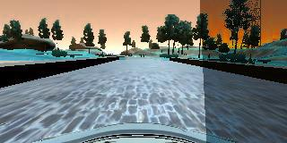
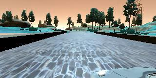
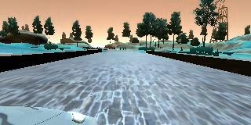
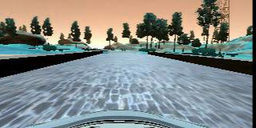
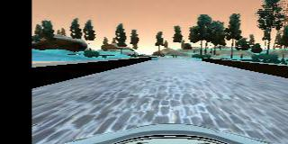
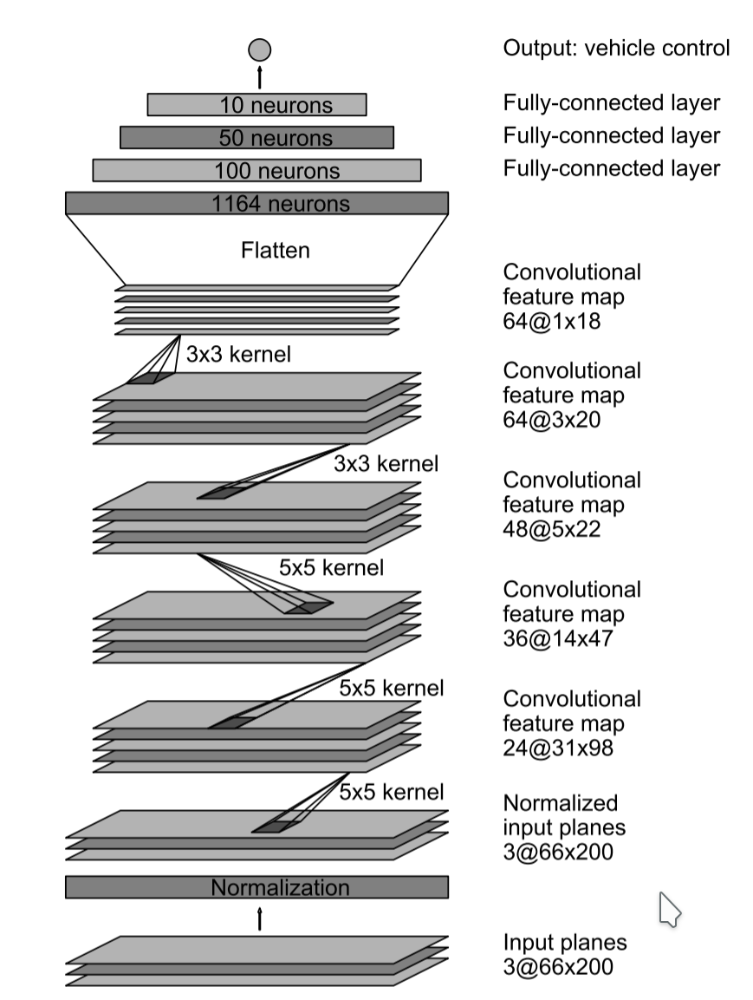

# Behaviorial Cloning Project

Overview
---
The goal of this project is to create and train a convolutional neural network so that:

when I feed this network with images comming from a camera installed at the top of the vehicle to predict the correct steering angle.
* I had to use the the simulator to collect data of good driving behavior
* Design, train and validate a model that predicts a steering angle from image data
* Use the model to drive the vehicle autonomously around the first track in the simulator
* Summarize the results with a written report

After a small research in the internet I found this model [NVIDIA](https://devblogs.nvidia.com/deep-learning-self-driving-cars/) and based on it I created my network.
At the end I managed to calculate the weights need so that the network drives the vehicle and no tire leaves the drivable portion of the track
surface.

Project Submission Files
---

* **model.py** - The script used to create and train the model
* **drive.py** - The script to drive the car
* **model.h5** - The saved model
* **README.md** - Markdownfile containing the documentation of the project
* **Udacity_behavioral_clonning_video_CMD.mp4** - a video recording of my vehicle driving autonomously

Training the data
---

I collected data from the simulator ~25000 images. I drove clockwise, counter - clockwise and I trained the network when the vehicles meets the road
lines to steer with big angles in order the vehicle to stay in the middle of the road.

Then I created augmented images to encrease the training data set, but also to introduce irregularities to my network to generalize it as much as possible.

<pre>               Center Image                         Random change of brightness </pre>

<pre>       Random change of shadowing                       Left camera Images  </pre>

<pre>           Right camera Images                  Horizontal flipping of the image  </pre>

<pre>    Horizontal translation of the image  </pre>

I generated ~45000 images. In order to optimize the computational time I stored the images with size (64x64x3). 

* I used correction factors to the steering angle (-0.25) when I used the images of the left camera and (0.25) of the right camera

* I used function to calibrate the steering angle when I horizontaly translated the images

Network Architecture
---
Based on the NVIDIA Model, I used: 

* Lamda layer in order to avoid saturation and having a better operation of the gradient descent
* I added dropout layers to avoid over fitting after the convolutional layers
* I used rectifier in order to introduce non-linearity.
 
 
| Layer (type)                     | Output Shape        | Param #  |
| :--------------------------------: |:-------------------:| :--------:|
| lambda_4 (Lambda)                | (None, 64, 64, 3)   | 0        | 
| conv2d_16 (Conv2D)               | (None, 30, 30, 24)  | 1824     | 
| conv2d_17 (Conv2D)               | (None, 14, 77, 36)  | 21636    | 
| conv2d_18 (Conv2D)               | (None, 5, 37, 48)   | 43248    |
| conv2d_19 (Conv2D)               | (None, 3, 35, 64)   | 27712    |
| conv2d_20 (Conv2D)               | (None, 1, 33, 64)   | 36928    |
| flatten_4 (Flatten)              | (None, 2112)        | 0        |
| dense_15 (Dense)                 | (None, 100)         | 211300   |
| dense_16 (Dense)                 | (None, 50)          | 5050     |
| dense_17 (Dense)                 | (None, 10)          | 510      |
| dense_18 (Dense)                 | (None, 1)           | 11      <pre>                   </pre>    |

| **Rectifier**                   | **NVIDIA Model**        |   |
| 
 | 
 

**Total params:** 143,419 **Trainable params:** 143,419 **Non-trainable params:** 0

* I shuffled the images and at the end spit 20% of the images and I created a cross validation data set.
* I used mean squared error for the loss function - This is the objective for minimization
* I used Adam optimizer and I used small learning rate to ensure converge of the optimization algorithm
* I used 5 epochs and ~12000 images to calculate the validation error

Conclusion
---
After the training and the calculation of the weight I saved the model and I run the simulator into the autonomous mode. The vehicle was moving
smoothly in the track remaining ~80% in the middle of the road.

**Optimization**

* Creating more training data taking also into consideration the jungle track
* Augmenting the images more by bluring or gray scale

We would be able to generalize more the network!! 

All in all GREAT experience. I am really looking forward to the next Project!!!

      python drive.py model.h5
	  

Video Results  
---

