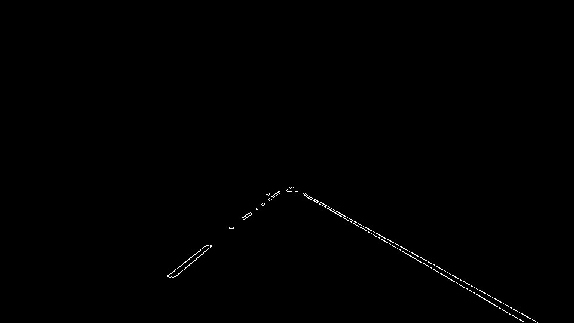
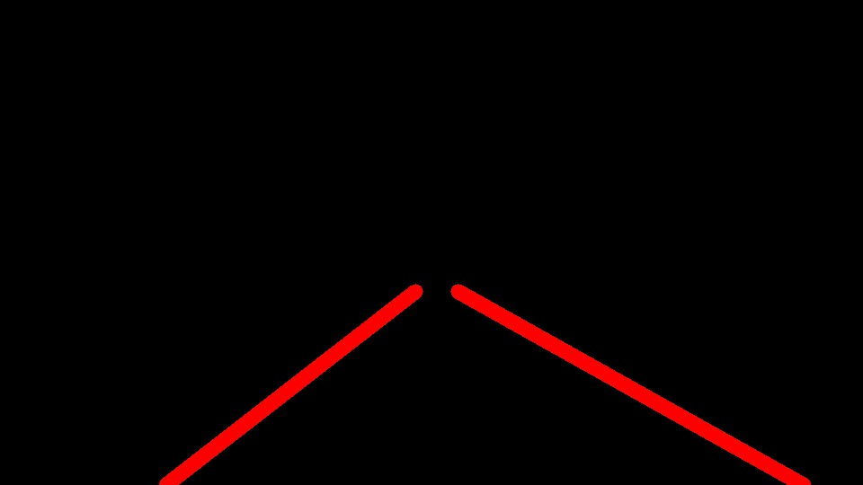

# **Finding Lane Lines on the Road** 

## Writeup Template

---

**Finding Lane Lines on the Road**

The goals / steps of this project are the following:
* Make a pipeline that finds lane lines on the road
* Reflect on your work in a written report

---

### Reflection

### 1. Describe your pipeline. As part of the description, explain how you modified the draw_lines() function.

My pipeline consists of:

1) Initially we are converting our image into grayscale

[//]: # (Image References)
"Grayscale"

2) Then we are bluring the image in order to detect the edges easier
[//]: # (Image References)
"Gaussian Blur"

3) Then by taking the grad of the image and by using thresholds to identify the biggest change of the colour of the pixels
we were able to identify the edges of the objects
[//]: # (Image References)
"Cunny Edge detection"

4) But now we have the edges of all objects of the images. We are interested only for a specific target area:
[//]: # (Image References)
"Cunny Edge detection - Specific area"

5) Now we are going to implement hough transformation and when we detect the lines we are going to extrapolate the left and the right part in order to create
the pipelines

We are seperating the lines based in a) Slope b) center. Then we have two lists with left and right slopes. Then we are extrapolating the centres to a lower and upper 
bound, taking into consideration the slope. 

[//]: # (Image References)
"Pipelines"

### 2. Identify potential shortcomings with your current pipeline

One potential shortcoming would be when we detect lines that are at the edge of the street or 
when we are moving in a close turn.

### 3. Suggest possible improvements to your pipeline

In order to make them more robust we have to separate the lines that have sharp slope and/or small length. Then we can save the "normal" lines and when a "not normal" appears
we neglect it and use the previous "normal" line. 

Also because of the fact that we need to fit a line in a set of multiple lines a linear regression method could potentially bring better results.

Video Output
---

