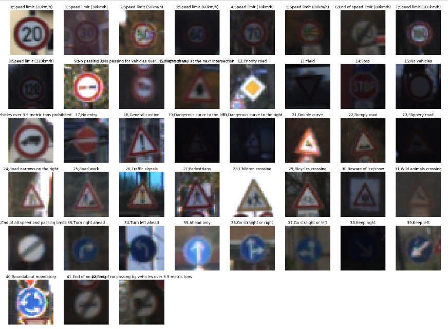
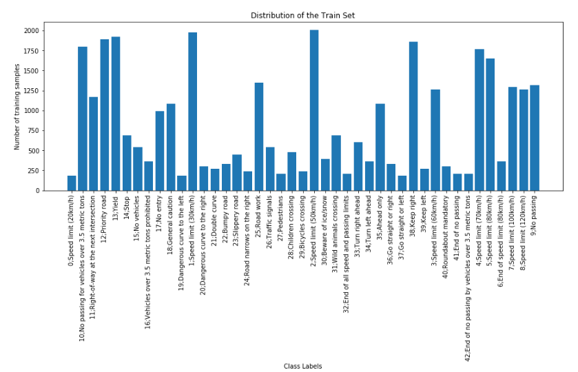
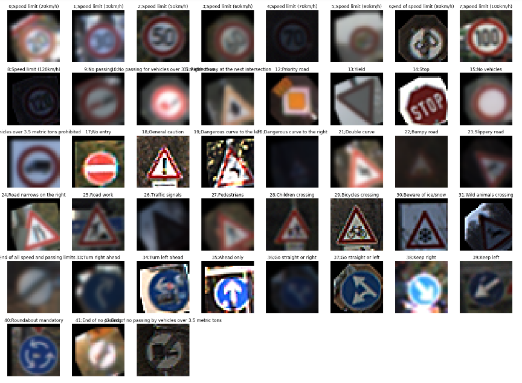
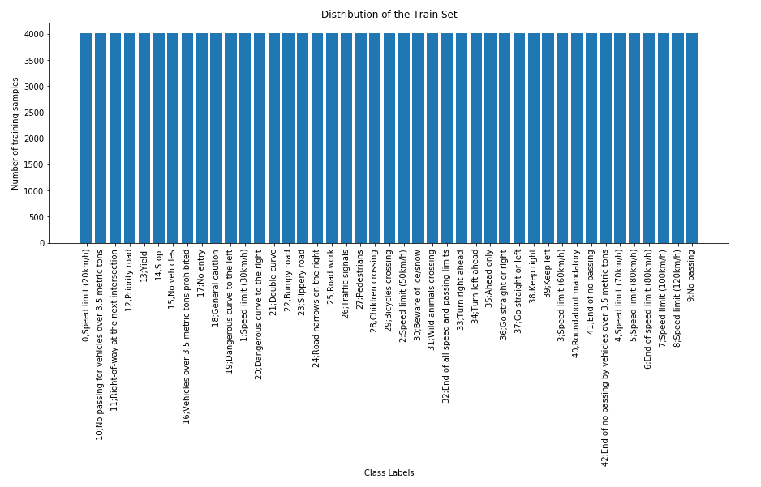
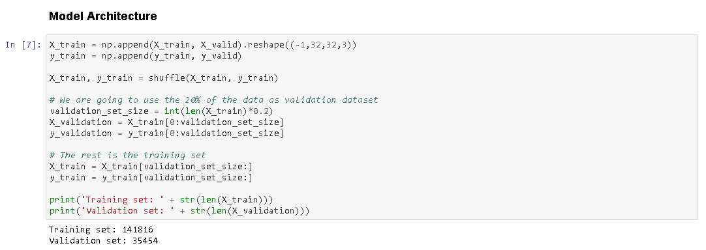
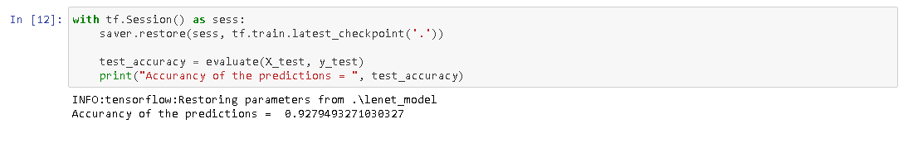
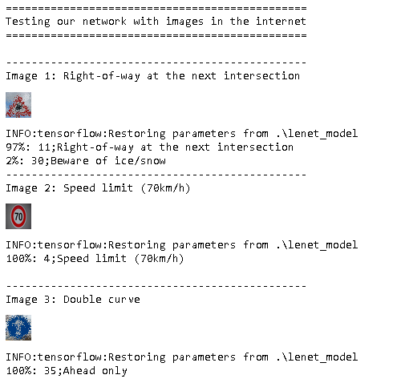
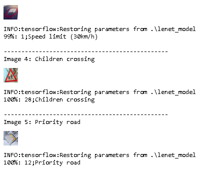

# **Traffic Sign Recognition** 

**Build a Traffic Sign Recognition Project**

The goals / steps of this project are the following:
* Load the data set (see below for links to the project data set)
* Explore, summarize and visualize the data set
* Design, train and test a model architecture
* Use the model to make predictions on new images
* Analyze the softmax probabilities of the new images
* Summarize the results with a written report

## Submission files
* Ipython notebook with code
* Html ouput of the code
* A write up report (presence)
  
## Project Implementation
- Initially I created a folder in order to save three sets of data:
	- Training data
	- Cross Validation Data
	- Testing data
	
- Then we printed out the length of the data in order to visualize the size of the data:

	- Number of training examples = 34799
	- Number of validation examples = 4410
	- Number of testing examples = 12630
	- Image data shape = [32, 32, 3]
	- Number of classes = 43
	
- We read the csv file in order to get the titles of the traffic signs and the classification number:

[//]: # (Image References)
"Training Data"

- In order to train better my network I created additional images for every class (Traffic Sign) --> 4020 images

- Using the train data set I generated new by using the following effects randomly for every image:

	- Rotating Translating the images
	- Blur
	- Sharpen 

- At the end we had:

	- Training set:        172860 (91.0%)
	- Cross Validation set:  4410 ( 2.3%)
	- training set:         12630 ( 6.7%)
	-         Sum:         189900
	
- Having a cross validation data set at about 2%, I merged the set with the training one and I separate them again:

- Table:

	- Training set:        141816 (74.6%)
	- Cross Validation set: 35454 (18.7%)
	- training set:         12630 ( 6.7%)
	-         Sum:         189900
	
- Now that I prepared the Training - CV - Testing sets I am going to create the architecture of Neural Network

 - I used the lenet architecture and I had to determine the Epochs, the size of the batch, features of the layers and filters.
 
  
 
 Searching in the internet I found out that this specific combination was given pretty good results and taking into consideration, that
 i have a really slow PC, I didn't have the luxury of time to further experiment. Later I will write ways to better optimize this process.

 
 
 
 - Running the model and save it. I tested the training data receiving 
 
 **Validation Accuracy 98% and Test Accuracy of 92.8%**
 
 The model was trained with Adams optimizer and after 2-3 iterations I found out that 0.001 learning rate was given good results. I used Epoch number 40, but I realized that after 30
the was slightly improving. Batch size 128 and finally I achieved 92.8% at the testing data. All in all I used ~20% as cross validation data set to calculate the weight og the layers 
and then by using the train dataset, that I didn't use for my model calibration, I reached 92.5% accuracy!!

Then I order verify that my model is working good, I download traffic signs images from the internet and I tested them, again with great success.

## Conclusion

That was a great project. I spent a lot of hours, researching and implementing but it was totally worth it. 

Testing our model we received accuracy approx. 92%. Then by downloading images from the internet we managed to receive 100% success. 

We tried to load an image that is not a sign but drawn on the street and we saw that our model FAILED to recognise it.

Of course we can optimize this process:

1) We can normalize or grayscale the images of the training set.

2) We can play more with model's parameters and learning rate.

That was a great experience and I am looking forward to the next project!!!
