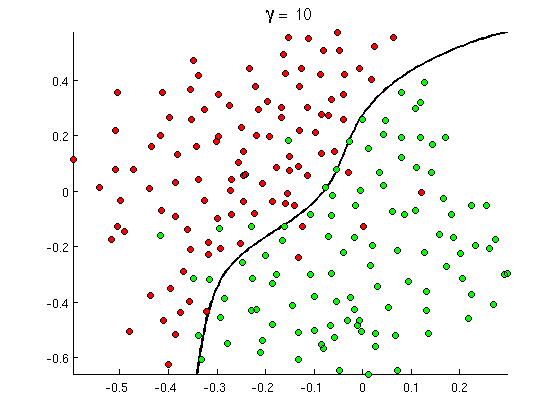

# Vehicle Detection

Project Goal:
---
In this project, my goal was to write a software pipeline to identify vehicles in a video from a front-facing camera on a car.
I was provided with a labeled dataset and my job was to decide what features to extract, then to train a classifier and ultimately 
track vehicles in a video stream!

So in order to meet project's specification I had to do the following:

1) The writeup / README should include a statement and supporting figures / images that explain how each rubric item was addressed, and specifically where in the code each step was handled.

2) **Histogram of Oriented Gradients (HOG)** : Explanation given for methods used to extract HOG features, including which color space was chosen, which HOG parameters (orientations, pixels_per_cell, cells_per_block), and why.
The HOG features extracted from the training data have been used to train a classifier, could be SVM, Decision Tree or other. Features should be scaled to zero mean and unit variance before training the classifier.

3) **Sliding Window Search**: A sliding window approach has been implemented, where overlapping tiles in each test image are classified as vehicle or non-vehicle. Some justification has been given for the particular implementation chosen.
Some discussion is given around how you improved the reliability of the classifier i.e., fewer false positives and more reliable car detections (this could be things like choice of feature vector, thresholding the decision function, hard negative mining etc.)

4) **Video Implementation**: The sliding-window search plus classifier has been used to search for and identify vehicles in the videos provided. Video output has been generated with detected vehicle positions drawn (bounding boxes, circles, cubes, etc.) on each frame of video.
A method, such as requiring that a detection be found at or near the same position in several subsequent frames, (could be a heat map showing the location of repeat detections) is implemented as a means of rejecting false positives, and this demonstrably reduces the number 
of false positives. Same or similar method used to draw bounding boxes (or circles, cubes, etc.) around high-confidence detections where multiple overlapping detections occur.

Histogram of Oriented Gradients (HOG)
---

In order to recognize vehicles in the street I had to train a classifier. I choosed to train a Linear SVM classifier, according to literature is providing
better results

Then having the training dataset with **car** and **no car** images, I had to decide how I am going to make the vehicle detection more robust.

The pre process method for the images that was chosen was: **Histogram of Oriented Gradients (HOG)**

The scikit-image hog() function takes in a single color channel or grayscaled image as input, as well as various parameters. These parameters include orientations, pixels_per_cell and cells_per_block.

The number of orientations is specified as an integer, and represents the number of orientation bins that the gradient information will be split up into in the histogram. Typical values are between 6 and 12 bins.

The pixels_per_cell parameter specifies the cell size over which each gradient histogram is computed. This paramater is passed as a 2-tuple so you could have different cell sizes in x and y, but cells are commonly chosen to be square.

The cells_per_block parameter is also passed as a 2-tuple, and specifies the local area over which the histogram counts in a given cell will be normalized. Block normalization is not necessarily required, but generally leads to a more robust feature set.

Combined features using both color and space, images were converted from RGB --> YCrCb color space. 

All histogramms were scaled in order to be taken equally into consideration.

We chose those parameters by experimenting and taking into consideration the **test accuracy of the SVM Classifier**. I used svm.SVC() function to train an SVM model

	print('-------------------Parameter Selection Process--------------------')
	print('SVC (C-Support Vector) Parameters')
	print('')
	print('Pixels per cell: ' + str(PixPerCell))
	print('Cells per block: ' + str(CellPerBlock))
	print('Orientation: ' + str(orient))
	print('-------------------------------------------------------------------')
	print('SVM Test Accuracy = ', round(svc.score(XTest, YTest), 4))
	

Sliding Window Search
---
I used a function FindCars extracts hog features  once, for each of a small set of predetermined window sizes (defined by a scale argument), and then can be sub-sampled to get all of its overlaying windows.
Each window is defined by a scaling factor that impacts the window size. The scale factor can be set on different regions of the image (e.g. small near the horizon, larger in the center).

I used the parameters and almost all the code of the lecture, I found out that was working good bringing back really much good results!

	ystart = 400
	ystop = 656
	scale = 1.5
	
Now I had to found a way to avoid duplicate detections or false positives and filter them out. 
I had to create bounding boxes for every vehicle that I was detecting. 

Also in order to encrease the performance of my algorithm more, I created a function "AddHeat".

The job of this function is to create a heat map and where most of the boxes are, is a strong indicator that the vehicles are also there,
I created a threshold of the maximum number of overlapping and at the and I managed to reduce false positives and to identify vehicles without duplicate
detections.

	heat = ApplyThreshold(heat,18)

Video Implementation
---
Creating a Pipeline using all the above functions I managed to implement it in a stream video!

Pipeline code & Conclusion
---
All in all I really injoyed this project. I learned a lot about computer vision and I am really looking forward to learn more. Unfortunately I didn't
have much time and I am sure that if I changed more the parameters, using the advanced training data by udacity then the results would be more robust and 
generalized!!

	def PipelineVideoCreation(img):
		OutImg = CreateVideoPreProcess(img)
		Bboxes = FindCars(OutImg, ystart, ystop, scale, svc, XScaler, orient, PixPerCell, CellPerBlock, SpatialSize, HistBins)
		BboxesDeque.append(Bboxes)
		heat = np.zeros_like(OutImg[:,:,0]).astype(np.float)
		AddHeatVideos(heat, BboxesDeque)
		heat = ApplyThreshold(heat,1)
		heatmap = np.clip(heat, 0, 255)
		labels = label(heatmap)
		DrawImg = DrawLabeledBboxes(np.copy(OutImg), labels)
		return DrawImg
		

------- END -------
---