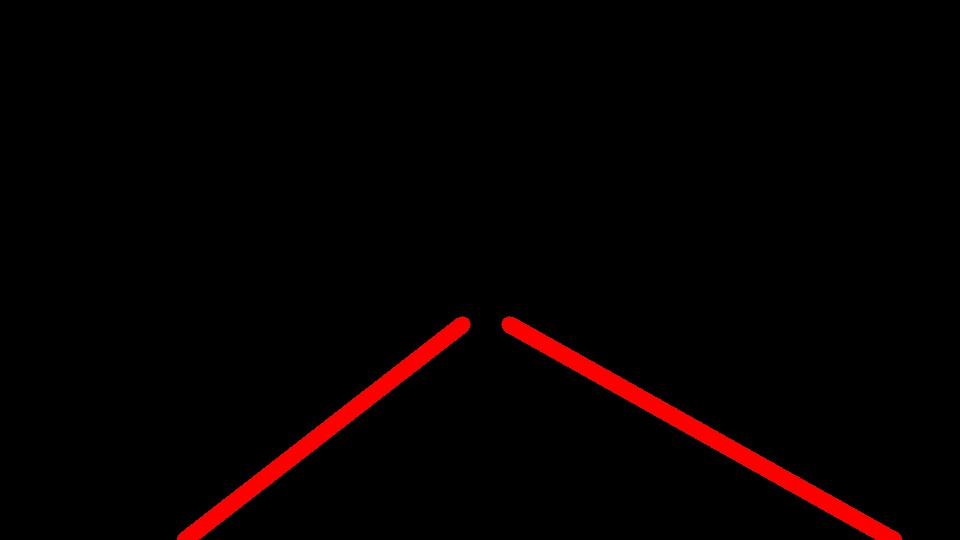
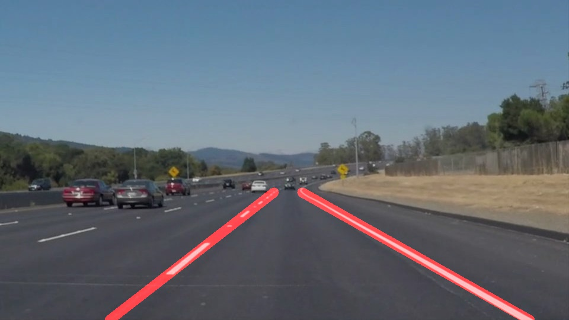
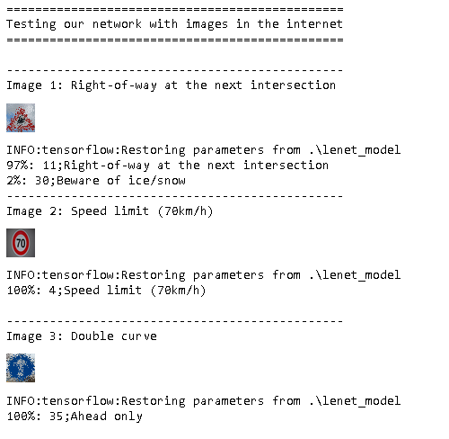
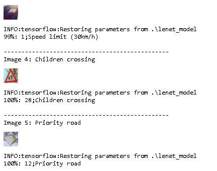

Description of the Projects
---

1) **CarND-LaneLines-P1-master**
---

Finding Lane Lines on the Road

The goals / steps of this project are the following:

Make a pipeline that finds lane lines on the road
Reflect on your work in a written report

2) **CarND-Traffic-Sign-Classifier-Project**
---

The goals / steps of this project are the following:
* Load the data set (see below for links to the project data set)
* Explore, summarize and visualize the data set
* Design, train and test a model architecture
* Use the model to make predictions on new images
* Analyze the softmax probabilities of the new images
* Summarize the results with a written report

3) **CarND-Advanced-Lane-Lines**
---

In this project, my goal was to write a software pipeline to identify the lane boundaries in a video from 
front-facing camera on a car.

4) **CarND-Behavioral-Cloning-P3**
---

The goal of this project is to create and train a convolutional neural network so that:

when I feed this network with images comming from a camera installed at the top of the vehicle to predict the correct steering angle.
* I had to use the the simulator to collect data of good driving behavior
* Design, train and validate a model that predicts a steering angle from image data
* Use the model to drive the vehicle autonomously around the first track in the simulator
* Summarize the results with a written report

After a small research in the internet I found this model [NVIDIA](https://devblogs.nvidia.com/deep-learning-self-driving-cars/) and based on it I created my network.
At the end I managed to calculate the weights need so that the network drives the vehicle and no tire leaves the drivable portion of the track
surface.

5) **CarND-Vehicle-Detection**
---

In this project, my goal was to write a software pipeline to identify vehicles in a video from a front-facing camera on a car.
I was provided with a labeled dataset and my job was to decide what features to extract, then to train a classifier and ultimately 
track vehicles in a video stream!

So in order to meet project's specification I had to do the following:

1) The writeup / README should include a statement and supporting figures / images that explain how each rubric item was addressed, and specifically where in the code each step was handled.

2) **Histogram of Oriented Gradients (HOG)** : Explanation given for methods used to extract HOG features, including which color space was chosen, which HOG parameters (orientations, pixels_per_cell, cells_per_block), and why.
The HOG features extracted from the training data have been used to train a classifier, could be SVM, Decision Tree or other. Features should be scaled to zero mean and unit variance before training the classifier.

3) **Sliding Window Search**: A sliding window approach has been implemented, where overlapping tiles in each test image are classified as vehicle or non-vehicle. Some justification has been given for the particular implementation chosen.
Some discussion is given around how you improved the reliability of the classifier i.e., fewer false positives and more reliable car detections (this could be things like choice of feature vector, thresholding the decision function, hard negative mining etc.)

4) **Video Implementation**: The sliding-window search plus classifier has been used to search for and identify vehicles in the videos provided. Video output has been generated with detected vehicle positions drawn (bounding boxes, circles, cubes, etc.) on each frame of video.
A method, such as requiring that a detection be found at or near the same position in several subsequent frames, (could be a heat map showing the location of repeat detections) is implemented as a means of rejecting false positives, and this demonstrably reduces the number 
of false positives. Same or similar method used to draw bounding boxes (or circles, cubes, etc.) around high-confidence detections where multiple overlapping detections occur.

